# Forge — as-built architecture snapshot (2026-05-17)

> **Status:** honest point-in-time snapshot. `ARCHITECTURE.md` is the
> *narrative / intended* architecture; **this file is the system as
> actually built** at the close of the 9-phase closure arc (the
> reactive-constraint stripback + review-redesign + contract-preflight
> work; commits up to Phase 8 / `b872297`). Where the two differ, this
> snapshot is the truth. Provenance: regenerated by reading the current
> code at Phase 9 — the prior snapshot (`…2026-05-16.md`) described the
> pre-stripback code (1.8k-LOC `cycle.ts`, auto-merge inside
> `runReviewer`, a §G "target" redesign that had not landed). All of
> that has since landed; this file folds the former §G into the main
> flow. Refresh from the reflection phase whenever the divergence list
> materially changes.

Grounded in current code (non-test LOC): `orchestrator/cycle.ts` (404 —
the thin spine), `cycle-context.ts` (201), `orchestrator/phases/*`
(1,859 across 6 runners), `pr.ts` (347), `scheduler.ts` (676),
`scheduler-dispatch.ts` (250), `loops/ralph/runner.ts` (254). Graphs are
Mermaid (valid; render in the IDE). Read order: A macro flow → B module
map → C per-phase internals → D queue → E recovery → F brain → G review
+ closure flow → H simplification ledger.

---

## A. Macro data flow (as-built)

Solid arrows = control/sequence. Labelled arrows = the artifact crossing
the seam. `runCycle` (`cycle.ts:58`) is the thin spine: it threads phase
outputs into the next phase's inputs and owns nothing else. The
**architect is an out-of-cycle human moment** — a `/forge-architect`
slash command run in the operator's own Claude session, **not wired into
`runCycle`** (`.claude/commands/forge-architect.md`). Its only handoff is
the files it writes. **Closure is the single terminal-move authority**;
**reflection fires only on a GitHub-confirmed merge**.

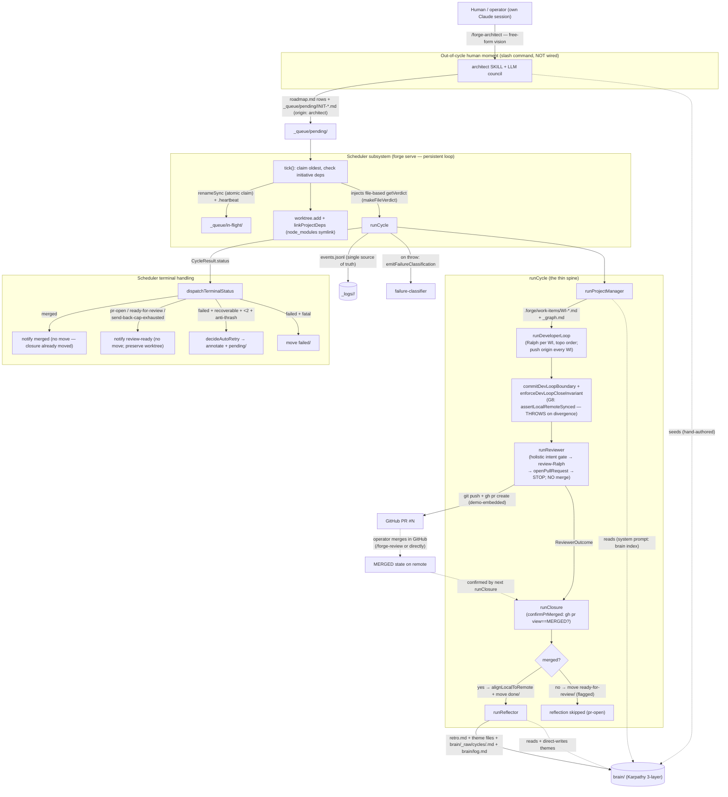

**Load-bearing honesty (what changed since the 2026-05-16 snapshot):**

- The PR is **created and then STOPPED at** inside `runReviewer`
  (`phases/reviewer.ts` — `openPullRequest`, no merge). `mergePullRequest`
  still exists in `pr.ts` but is **unreachable from any product path**
  (`runCycle` / `scheduler` / `phases/*`) — closure-matrix **G9** asserts
  this by grep.
- `_queue/done/` is written **only by `runClosure`**
  (`phases/closure.ts`), **only after `confirmPrMerged`** (`gh pr view
  --json state` == `MERGED`) returns true. So **`done/` ⇒ the PR is
  MERGED** is now true (was the "`done/` ≠ merged" defect). The reviewer
  moves nothing; the closure step is the **single** mover (matches
  `queue.ts:moveTo`'s `from = in-flight` contract; removed the
  double-move defect where the reviewer moved to `ready-for-review/` and
  closure's `done/` move silently no-op'd).
- Reflection (`runReflector`) is nested under `if (closure.merged)` in
  `cycle.ts` — it fires **only on a confirmed remote merge** (G10).
  Right after PR creation `confirmPrMerged` is false, so the unattended
  cycle terminates at `pr-open`; a later re-trigger re-checks and
  proceeds once the operator has merged.
- The dev-loop **pushes the initiative branch to origin after every
  WI** and `cycle.ts` asserts the **G8 local↔remote invariant**
  (`origin/<branch>` == local HEAD AND `main` == merge-base) at dev-loop
  close — a divergence **throws** and is classified (the branch is not
  reviewable).

---

## B. Module map (component dependency graph)

`X --> Y` = X imports/consumes Y. The defining post-stripback shape:
`cycle.ts` is a 404-LOC spine that imports the five phase runners;
shared types + cross-runner helpers live in `cycle-context.ts` (phase
modules import **from there, never from `cycle.ts`** — acyclic by
construction); PR/remote-sync is one module (`pr.ts`); the terminal
move is one module (`phases/closure.ts`).

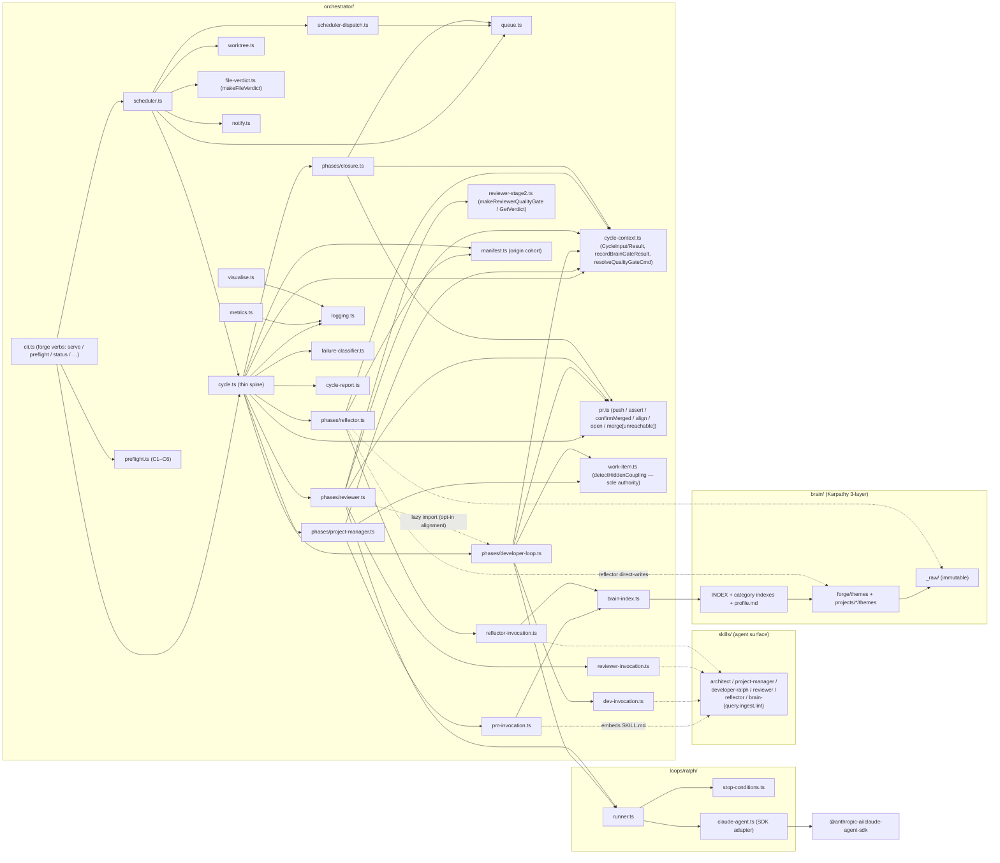

### Module responsibilities, inputs, outputs

| Module | Responsibility | Inputs | Outputs | Notes |
|---|---|---|---|---|
| `cycle.ts` | Thin spine: PM→dev→boundary→review→closure→(reflect); failure classification + report on throw | `CycleInput` | `events.jsonl`, `CycleResult`, cycle report | 404 LOC; owns no phase logic |
| `cycle-context.ts` | Shared `CycleInput`/`CycleResult`/`CycleOutcome`/`ReviewerOutcome` types + `recordBrainGateResult` + `resolveQualityGateCmd` | — | the cross-runner contract | acyclic seam; never imports `cycle.ts` |
| `phases/project-manager.ts` | Invoke PM skill, validate WI set, run `detectHiddenCoupling`, brain-gate (throws) | in-flight manifest, worktree | `.forge/work-items/WI-*.md`, `_graph.md` | sole `detectHiddenCoupling` caller (G4) |
| `phases/developer-loop.ts` | Ralph per WI in topo order; push origin per WI; skip dependents of failed prereqs | WI set | commits on initiative branch, WI status | throws ONLY on 0/N (total failure) |
| `phases/reviewer.ts` | Holistic intent gate (may spawn dev-loop) → review-Ralph → `openPullRequest` → STOP | initiative branch, manifest, WI set | demo-embedded PR; `ReviewerOutcome` | NEVER merges (G9); moves no manifest (G1) |
| `phases/closure.ts` | Single terminal-move authority; `confirmPrMerged` → align local↔remote → `done/` else `ready-for-review/` | `ReviewerOutcome`, worktree | queue move; `ClosureResult.merged` | the ONLY merge signal (G1/G10) |
| `phases/reflector.ts` | Consume event log + merged tree → brain theme writes; cohort-tagged by `origin` | events.jsonl, manifest | `retro.md`, themes, cycle archive | log-and-continue; runs only post-merge |
| `pr.ts` | Sole `git push` / `gh pr …` boundary for the initiative branch | worktree | push/PR/merge-confirm/align primitives | `mergePullRequest` retained but unreachable from product (G9) |
| `scheduler.ts` | Claim loop, worktree pool, deps, recovery; injects file-based verdict; preserves worktree for non-merged terminals | `_queue/pending/`, heartbeats | queue moves, notifications | 676 LOC |
| `scheduler-dispatch.ts` | Terminal-status → notification (+ failure-only bounded auto-retry) | `CycleResult`, log | `_queue/failed/` or `pending/` (retry); notify | success-path moves owned by closure |
| `preflight.ts` | C1–C6 forge↔project contract gate (pure) | project dir | `PreflightReport` (hard C1/C2/C4 fail; C3/C5/C6 warn) | `forge preflight` CLI verb (US-4.1) |
| `loops/ralph/runner.ts` | Generic iterate-until-stop driver | PROMPT/AGENT/fix_plan, qualityGate, budgets | `LoopResult` | drives BOTH dev-loop and review-Ralph |

---

## C. Per-phase internals + multi-layered I/O

### C.1 Project-manager (`runProjectManager`, `phases/project-manager.ts`)

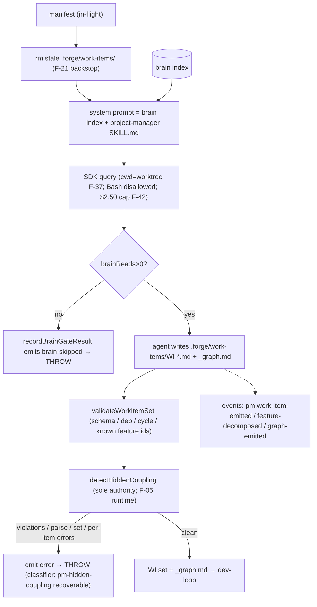

| Layer | In | Out |
|---|---|---|
| Artifact | `_queue/in-flight/INIT-*.md` | `<wt>/.forge/work-items/WI-<n>.md`, `_graph.md` |
| Knowledge | brain index (in system prompt) + Glob of the real worktree (cwd=worktree) | — |
| Telemetry | — | `pm.*` events, tool_use tally, brain-gate result |
| Gate | brainReads>0 (THROW), validateWorkItemSet, detectHiddenCoupling | `hidden_coupling_violations` metadata |

> Note: the F-36 `validateFilesInScopeAgainstWorktree` path-validator is
> **removed from the cycle** (deleted in Phase 1; `detectHiddenCoupling`
> is the single coupling/path authority — closure-matrix **G4**).

### C.2 Developer loop (`runDeveloperLoop`, `phases/developer-loop.ts`)

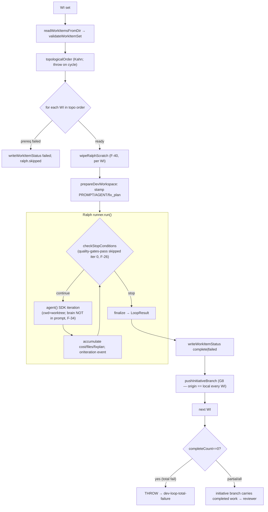

Stop conditions: `quality-gates-pass`, `iteration-budget`,
`cost-budget` ($1.0/WI, $0.50/iter cap), `wedged`. The gate is the
**single** `resolveQualityGateCmd` (`cycle-context.ts`) threaded
identically to dev-loop and reviewer (F-04). Commit is the agent's own
Bash, backstopped by `commitDevLoopBoundary` then
`enforceDevLoopCloseInvariant` (push + **G8 assert**, throws on
divergence). **Partial completion is not fatal** — only 0/N throws; the
reviewer's send-back loop is the gap-filler.

### C.3 Review loop (`runReviewer`, `phases/reviewer.ts`) — as-built

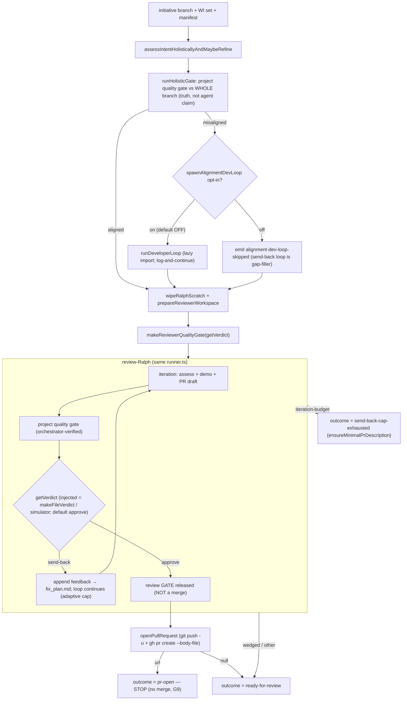

The reviewer **never merges and moves no manifest** (G9 + G1). On an
approved verdict it `openPullRequest` then **STOPS**, returning
`pr-open`; `closure.ts` decides `merged` vs `pr-open` strictly from a
GitHub-confirmed merge. Adaptive iteration cap
(`computeAdaptiveReviewIterationCap`: 3→8 by changed-file count, F-30).
The holistic-refinement **alignment dev-loop is a wired structural hook,
default OFF** (`CycleInput.spawnAlignmentDevLoop`) — the LLM-driven
targeted-WI synthesis is a clearly-commented SEAM (needs a live bench;
G8/G9/G10/G1 don't depend on it). Brain-read is **removed** from the
reviewer (F-41 — intent is wholly in the WI/manifest the planner
authored); `brainReads` is tallied for telemetry, not gated.

### C.4 Closure (`runClosure`, `phases/closure.ts`) — the terminal authority

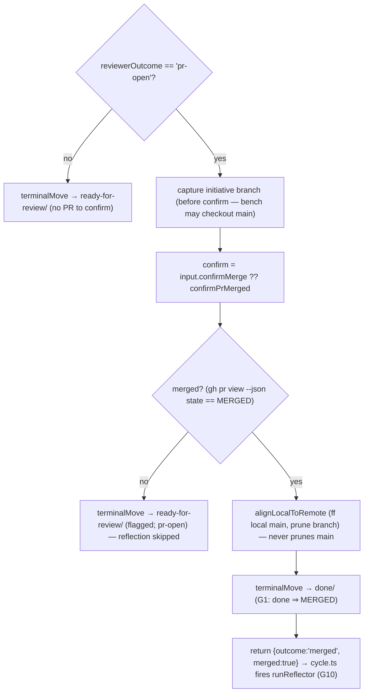

`confirmPrMerged` returns **false (never throws)** for every non-MERGED
case (open PR, no PR, `gh` unavailable, GraphQL error) → routed to
`ready-for-review/`. Production omits `CycleInput.confirmMerge` so the
default `confirmPrMerged` is used; the chained bench injects a hook that
models the operator clicking "merge" (drives its `gh`-shim) so the
chain exercises closure + reflection end-to-end — `mergePullRequest`
stays unreachable from every product path.

### C.5 Reflection (`runReflector`, `phases/reflector.ts`)

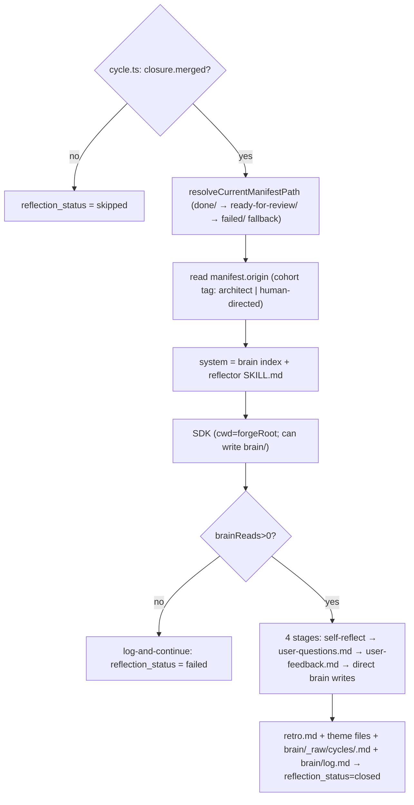

Reflection is **gated on `closure.merged`** in `cycle.ts` — it cannot
run on an unmerged cycle (G10). Failure is **log-and-continue**
(`reflection_status` telemetry only; never changes `CycleResult.status`).
The `origin` tag is carried onto `reflector.end` so a reflection-cohort
reader can split autonomous vs hand-directed retros (G6).

---

## D. Queue state machine

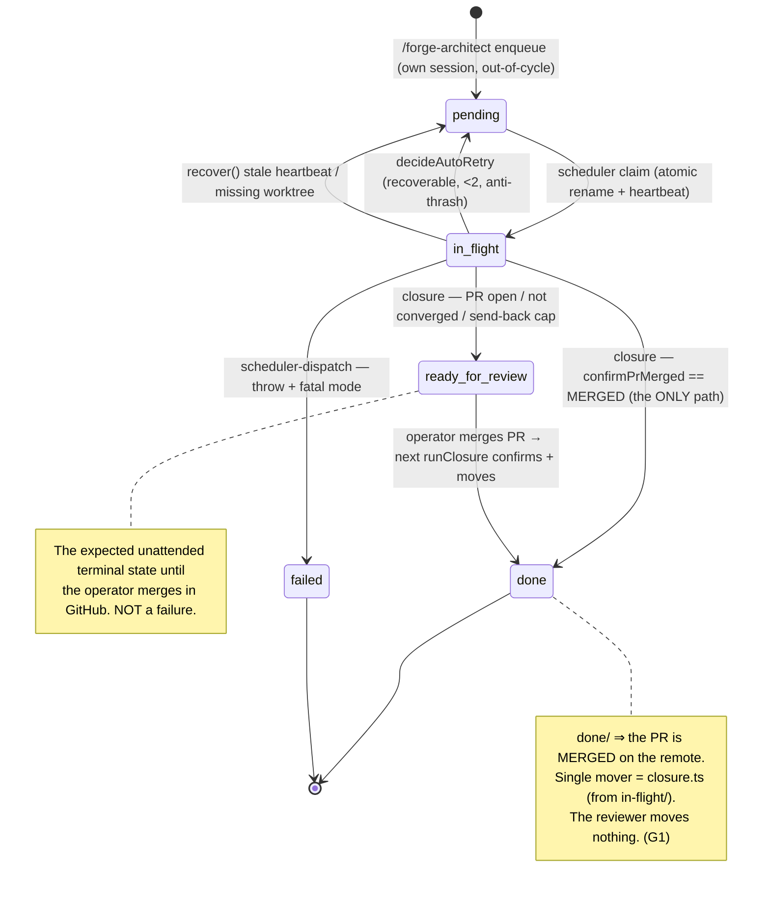

`moveTo` always moves **from `in-flight/`** — the closure step is the
single caller for `done/` / `ready-for-review/`; `scheduler-dispatch`
owns only the failure-path move (`failed/`) and the recoverable-retry
move (`pending/`). The manifest **stays in `in-flight/` through the
entire review phase** (it is in flight) — the prior double-move defect
(reviewer→`ready-for-review/` then closure's `done/` no-op) is gone.

---

## E. Failure classification + bounded auto-retry

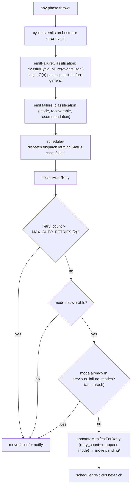

Recoverable modes self-heal up to 2 retries with anti-thrash (a mode
that already failed once is not retried again). Fatal modes stop with a
named diagnosis. Classification reads the **durable event log** the
cycle just finished writing (including the orchestrator-level error
event), so the diagnosis survives worktree cleanup.

---

## F. Brain read/write topology

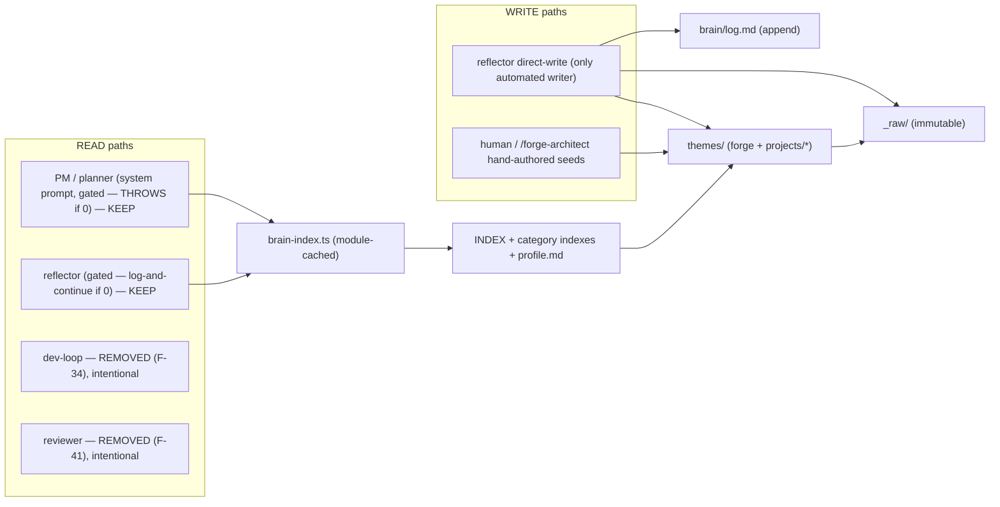

**Policy (operator-confirmed, durable in brain theme
`brain-read-policy`; ADR-010 amended; `PRINCIPLES.md` P4):** the
**planner/PM and reflector read** the brain (antipatterns + historical
work-sizing inform slicing; retro grounding); the **dev-loop and
reviewer do NOT** (intent is wholly captured in the work items the
planner authored — one source of intent, brain cost not paid twice).
Reads go through the INDEX / category indexes / profile (navigation
metadata), not full scans. **Eventual-consistency caveat (documented at
`pm-invocation.ts`):** `brain-index.ts` is module-cached, so themes
written by cycle N are invisible to cycle N+1 within the same
`forge serve` process until restart.

---

## G. Review + closure flow (the as-built contract — formerly the §G "target")

> The prior snapshot carried this as a not-yet-built **target redesign**.
> It has **landed** (Phases 6–7). This section is now the as-built; it is
> the same flow folded into §A/§C, restated end-to-end with the contract
> guarantees and their closure-matrix anchors.

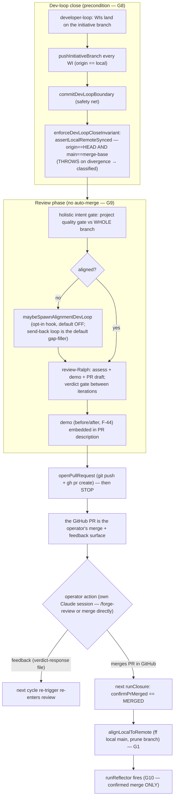

| Dimension | As-built guarantee | Anchor |
|---|---|---|
| Local↔remote | initiative branch pushed every WI; `assertLocalRemoteSynced` throws on divergence at dev-loop close | G8 / US-5.3 |
| PR creation | `runReviewer` creates the demo-embedded PR after the holistic gate, then STOPS | G9 / US-1.3 |
| Auto-merge | none reachable from product; `mergePullRequest` retained in `pr.ts` but unreachable from `runCycle`/`scheduler`/`phases/*` | G9 / US-3.2 |
| Verdict source | scheduler injects file-based `makeFileVerdict` (operator's own session via `/forge-review`); bench uses a simulator; the `defaultGetVerdict` approve never merges | US-3.1 / US-3.2 |
| Terminal move | single authority = `closure.ts` from `in-flight/`; reviewer moves nothing | G1 / US-5.2 |
| `done/` meaning | written ONLY after `confirmPrMerged` (`gh pr view` == MERGED) | G1 / US-5.2 |
| Reflection trigger | nested under `if (closure.merged)` — a confirmed remote merge only | G10 / US-1.4 |
| Architect | out-of-cycle human moment (`/forge-architect`), not wired into `runCycle` | US-1.0 / US-3.1 |

---

## H. Simplification ledger (what the stripback resolved)

The 2026-05-16 snapshot's §H listed eight gaps/candidates. Status now:

1. **Ralph drives two missions through one `runner.ts`** — retained by
   design (one loop runtime, two roles: dev-loop + review-Ralph),
   parameterised by system prompt + verdict-aware quality gate. Accepted
   (US-7.1: consolidate, don't fork the engine).
2. **PR/merge inside `runReviewer`** — RESOLVED. Extracted to `pr.ts`
   (Phase 3); merge removed from the product path entirely (Phase 6).
3. **Two coupling/path validators** — RESOLVED. The dead
   `validateFilesInScopeAgainstWorktree` is deleted (Phase 1);
   `detectHiddenCoupling` is the sole authority (G4).
4. **Dead classifier mode `pm-hallucinated-paths`** — RESOLVED. Removed
   end-to-end (Phase 1; closure-matrix G3-b).
5. **Brain-index module cache** — DOCUMENTED (eventual-consistency
   window noted at `pm-invocation.ts`; closure-matrix US-2.3).
6. **`*-invocation.ts` LOC vs ADR-011** — the shared bench↔live prompt
   contracts are ~1,170 LOC; ADR-011's "~150 LOC scheduler" stands as a
   *pressure*, not a measured fact. The orchestrator is ~10,857 non-test
   LOC across 34 files (no single file > 800 — closure-matrix SIMPL-LOC;
   `cycle.ts` itself is 404).
7. **Architect out-of-cycle and hand-run** — RESOLVED as a *designed
   property*, not a gap: it is a `/forge-architect` slash command in the
   operator's own session, explicitly documented as out-of-cycle
   (ARCHITECTURE.md §2; brain `human-interaction-via-own-session`).
8. **Notification taxonomy drift** — RESOLVED. One notify sink threaded
   via `resolveNotifyConfig()` (Phase 3; closure-matrix US-7.1-notify).

Standing constraint (US-7.1/7.2): adding surface to satisfy a story is
a defect to redesign, not accept. The contract preflight (`preflight.ts`,
ADR-017) is the codified front door: a project either passes C1–C6 or
forge declines with the failing clause named.

---

## UPDATE 2026-05-18 — operator-review reliability pass (supersedes the above where they differ)

Surfaced driving real trafficGame arcs with the agent acting as the
operator (world-graph-connectivity + the world-map review PR #54). All
landed on `main` (merge `77cff66`); tsc clean, 489 unit tests,
`closure-check --tier=fast` 25/25.

- **`alignLocalToRemote` (pr.ts) — the #1 fix.** Was `git update-ref
  refs/heads/main` with **no checkout** ("main may be checked out
  elsewhere"). In the normal operator-merge path the project repo *is*
  the `main` checkout, so the operator's working tree stayed frozen at
  pre-merge code with a huge phantom dirty `git status` — they opened the
  repo and saw old code. Now: when the project repo is the `main`
  checkout, bring its **working tree** forward with a guarded
  `merge --ff-only`, **stashing/restoring uncommitted operator state**
  (e.g. the architect's `roadmap.md`) — never silently discarded; bare
  ref-move kept only as the not-on-main fallback.
- **`embedDemoInPr` (pr.ts) — the PR is the sole review window.** The
  reviewer's demo lived in gitignored `.forge/demos/` (invisible to a PR
  reviewer). Now copied to a tracked `demo/<id>/`, committed on the
  branch before the push, and surfaced in the PR body **visibility-
  aware**: a relative-link `DEMO.md` for **private** repos (GitHub's
  image proxy cannot fetch private raw URLs → inline `` renders
  broken), inline raw images only when `gh repo view` says public.
  Default-private if unknown. Pattern: `brain/forge/themes/pr-as-sole-review-window.md`.
- **`node_modules` symlink can no longer be committed.** `linkProjectDeps`
  (scheduler.ts) writes the worktree git-exclude; `commitDevLoopBoundary`
  (cycle.ts) also unstages it; project `.gitignore` tightened. (The
  self-referential symlink had been merged into a project main.)
- **Reviewer per-iteration $/turn budget guards removed**
  (`REVIEWER_LIVE_MAX_*` deleted). They were undersized — every review
  iteration was cut at ~$0.60 before producing a verdict (0 verdicts,
  mislabelled `send-back-cap-exhausted`). The reviewer Ralph loop is now
  bounded **only** by the adaptive iteration cap. Benches still pass an
  explicit `reviewIterationBudgetUsd`. `reviewer.send-back-cap-exhausted`
  now records `verdicts` / `never_reached_verdict` for diagnosability.
- **`demo-runtime.startServer`** prefers built `preview` over the
  dev/watch server when a build output exists (deterministic capture; the
  watch server was the stale-capture class).
- **preflight** gained an advisory **BRAIN** clause (themes citing
  `src/`/`tests/` paths that no longer exist → WARN; the planner reads
  the brain first, so a stale theme silently poisons it). **classifier**
  gained `pm-thrash-no-converge` (PM hit a turn/$ cap **and** emitted
  degenerate WIs → NOT auto-retried; recommends `forge preflight` +
  manifest sharpening, not a blind retry). ADR-017 updated.
- **Queue hygiene:** the discarded `INIT-2026-05-10-trafficgame-jsdoc`
  (roadmap: "dropped — no-op (absorbed)") was cleared out of
  `ready-for-review/` to `failed/` with its stale `.seen` scratch
  removed; `_queue/` is now pending 0 / in-flight 0 / ready-for-review 0
  / done 9 / failed 4.

Doc alignment done in the same pass: `README.md` (operator
human-in-the-loop walkthrough rewritten; scaffold/CLI/status refreshed),
`docs/phases/review-loop.md`, `ARCHITECTURE.md`, `docs/decisions/017`,
`CLAUDE.md`. Brain verified clean (index coverage both scopes;
`forge preflight trafficGame` → PASS BRAIN · CONTRACT MET).
