# Forge v2 — Bottom-Up C4 Architecture

> A holistic, **bottom-up** model of forge built from a ground-truth code read
> (not the narrative docs) on **2026-05-30**, using the
> [`c4-architecture`](https://github.com/bitsmuggler/c4-skill) Claude Code skill
> (Structurizr DSL → C4-PlantUML + Mermaid → SVG/PNG).
>
> Purpose: a **shared visual baseline** to talk changes around, and a lens that
> surfaces what could be **refined or simplified**. The single source of truth is
> [`workspace.dsl`](./workspace.dsl); everything in `diagrams/` is generated from it.

## How to view

- **Styled, zoomable (recommended):** the `diagrams/c4-*.svg` files — colour-coded
  (navy = person, grey = external, cylinder = filesystem store, hexagon = skill,
  orange = cycle phase, green = scheduler tier). Embedded below.
- **Static fallback:** `diagrams/structurizr-*.png` (C4-PlantUML; mono-blue, no shapes).
- **Editable sources:** `diagrams/structurizr-*.mmd` (Mermaid — renders natively in
  Obsidian/GitHub) and `diagrams/structurizr-*.puml` (C4-PlantUML).

## How to regenerate

The `/c4` command is installed globally (`~/.claude/commands/c4.md`). After an
architecture change, either run `/c4` in this directory, or by hand:

```bash
cd docs/architecture/c4
# validate
docker run --rm -v "$PWD":/usr/local/structurizr structurizr/structurizr \
  validate -workspace /usr/local/structurizr/workspace.dsl
# export (run container as your UID so it can write the host dir)
docker run --rm --user "$(id -u):$(id -g)" -v "$PWD":/usr/local/structurizr \
  structurizr/structurizr export -workspace /usr/local/structurizr/workspace.dsl \
  -format mermaid -output /usr/local/structurizr/diagrams
# render styled SVG from the Mermaid (mermaid-cli must run as its OWN user)
for f in diagrams/structurizr-*.mmd; do n="${f#diagrams/structurizr-}"; n="${n%.mmd}"; \
  docker run --rm -v "$PWD/diagrams":/data minlag/mermaid-cli \
    -i "/data/structurizr-$n.mmd" -o "/data/c4-$n.svg" -c /data/.mmdc-config.json -b white; done
```

---

## Level 1 — System Context

One operator; the Agent SDK that runs **every** agent; GitHub as the sole merge
surface; the managed repos forge builds; and the tools that render/index the brain.
The three human moments all run **on the forge UI** (ADR 023 — the UI is the sole
operator interaction surface); the bridge writes the handoff files the phases consume.



> Wider frame (everything in one picture): [`c4-Landscape.svg`](./diagrams/c4-Landscape.svg).

---

## Level 2 — Containers

Inside forge: the **Orchestrator Engine** (the `forge serve` hot path), the **skill
catalog** it runs on the SDK, the operator surfaces (**CLI**, **UI Bridge**,
**forge-ui**, **Monitor**), and the three filesystem **stores** (queue, event log,
brain). The density of cross-edges here is itself a talking point — see
[Simplification candidates](#simplification-candidates).



---

## Level 3 — Components

### Orchestrator Engine

The scheduler tier (persistent unattended loop), the cycle spine + five phases, the
swappable Ralph runtime, and the shared machinery (queue state-machine, worktree
manager, PR/git adapter, verdict provider, event logger, failure classifier).



### Skill Catalog (the agent surface)

The phase skills + the brain skills. Every skill runs on the Agent SDK; planners and
the reflector **must** `brain-query` first; `brain-ingest` is the brain's only writer.



### Brain (three knowledge graphs)

Brain 1 (forge-dev), Brain 2 (cycles), and the per-project Brain 3 that lives **inside
each managed repo**. Each scope = `_raw/` (immutable) + `themes/` + category indexes +
a graphify graph.



---

## Deployment — how it actually runs today

A single WSL2 workstation hosts the Node process (engine + CLI + UI bridge + skills),
the Next.js UI, tmux, and the working tree; Anthropic + GitHub are the only cloud nodes.



---

## Dynamic — the flows that matter

### Idea → merged PR (unattended cycle, with the three human moments)



### One developer-loop iteration



### How forge learns cycle-over-cycle



---

## Simplification candidates

Bottom-up observations from the code read. These are **prompts for discussion**, not
verdicts — each needs to be weighed against the [five principles](../../../PRINCIPLES.md)
and the ADRs before acting.

> **Update 2026-05-30 — UI-as-sole-surface pass ([ADR 023](../../decisions/023-ui-sole-operator-surface.md)).**
> Candidate #3 (verdict paths) is now largely actioned: the two **dead** PR-comment
> verdict mechanisms (`review-router`, `pr-verdict`) and the never-invoked `getVerdict`
> provider seam were deleted, the stale/wrong `/forge-review` command removed (~840
> lines), and in a follow-up the parity-covered live fallbacks `cli/forge-send-back.ts`
> + the `/forge-reflect` slash / `forge-reflect-cli.ts` were retired (the UI-bridge
> verdict + reflect handlers are the single seam; `file-verdict.ts` is now just the
> parser). Remaining: `forge review --approve` (load-bearing for `verify-cycle.mjs`),
> the architect-canonical decision (#4), #5 (`gh-shim`), and the deeper **HumanMoment**
> generalization — per ADR 023 §4.

1. **Three layers per cycle phase.** Each phase exists as a `SKILL.md` (`skills/`),
   an `*-invocation.ts` prompt/tool contract (`orchestrator/`), **and** a
   `phases/*.ts` runner. That's three hops per phase × five phases. `reviewer.ts` is
   already thin (no contract needed). Candidate: collapse contract + runner for the
   phases that don't earn the split. *(Touches the per-phase invocation contracts —
   the documented seam — so weigh carefully.)*

2. **Demo subsystem sprawl.** One capability (the before/after review demo) spans
   `skills/demo`, `skills/demo-capture`, and `cli/demo.ts | demo-html.ts |
   demo-model.ts | demo-runtime.ts | demo-script.ts` — ~7 modules across two layers.
   Largest single surface for one feature. Candidate for consolidation behind one
   demo module.

3. **Multiple verdict-ingestion paths.** "Operator says approve / send-back" arrives
   via `file-verdict.ts`, `pr-verdict.ts`, `review-router.ts` (PR-comment poller),
   `cli/forge-send-back.ts`, and UI-bridge verdict files. Candidate: one verdict
   provider interface with pluggable sources, so the cycle sees a single seam.

4. **Architect runs two ways.** Out-of-cycle in the operator's session
   (`skills/architect` via `/forge-architect`) **and** an in-UI server-side runner
   (`orchestrator/architect-runner.ts`, [ADR 020](../../decisions/020-architect-in-ui.md)) — two
   code paths + state machines for the same human moment. Confirm both are still
   warranted, or designate one as canonical.
   *(Decided 2026-05-30 — **the in-UI runner is canonical.** The out-of-cycle path
   was retired: deleted the dead `architect-commit.ts` + the broken `/forge-architect`
   slash + the now-unused PLAN.md annotation parser. `skills/architect/SKILL.md`
   stays as the runner's prompt. See ADR 023 §4.)*

5. **`gh-shim` is a parallel path through the safety-critical adapter.** Every
   git/gh op in `pr.ts` has a no-origin local shim (`gh-shim.ts`). If real managed
   projects all have origins, the shim is carried weight on the most invariant-heavy
   code (the local↔remote sync guards). Candidate: scope the shim to test/dogfood only.
   *(Decided 2026-05-30 — **KEPT.** A deliberate capability per operator guidance
   2026-05-24: it lets forge run cycles against no-remote repos, dodging auth/network
   flakiness. Dormant today (all real projects have origins) but cleanly gated via
   `hasOriginRemote()` and orthogonal to the operator-surface work. See ADR 023 §4.)*

6. **Brain skills that wrap a CLI.** `brain-lint` and `brain-index` exist as **both**
   a skill (`skills/`) and a CLI (`cli/` + `forge brain …`). The skill layer is a
   thin wrapper. Candidate: have callers (e.g. reflector) invoke the CLI directly and
   retire the wrapper skill, unless the SDK-tool framing earns its keep.

7. **The CLI container is a grab-bag.** `cli/` holds operator commands **and** the
   human-moment renderers (`architect-plan.ts`) **and** the demo builder. Fine
   today; flag if it keeps accreting unrelated concerns.

### What the model confirms is healthy (don't "simplify" these)

- **No reinvented infrastructure** — the queue is a filesystem state machine, not a
  job queue/worker/resource controller (ADRs 011–013); no model runtime/vector
  DB/harness is hosted (the SDK does that). The container diagram has *no* such boxes.
- **Single terminal-move authority** — only `closure.ts` moves a manifest to `done/`,
  and `done/` ⇒ MERGED. The dynamic view shows one closure edge, not many.
- **Append-only event log as the single source of truth** — the UI, metrics, and
  reflection all derive from `_logs/<id>/events.jsonl`; the UI bridge is stateless.
- **Swappable loop** — the dev/review phases drive the Ralph runtime behind an
  interface (`loops/_adapters/` is the placeholder), so the agent loop can be A/B'd.

---

## File index

| View | Styled SVG | Mermaid src | C4-PlantUML | PNG |
|------|-----------|-------------|-------------|-----|
| Landscape | `c4-Landscape.svg` | `structurizr-Landscape.mmd` | `.puml` | `.png` |
| Context (L1) | `c4-Context.svg` | `structurizr-Context.mmd` | `.puml` | `.png` |
| Containers (L2) | `c4-Containers.svg` | `structurizr-Containers.mmd` | `.puml` | `.png` |
| Engine Components (L3) | `c4-EngineComponents.svg` | `structurizr-EngineComponents.mmd` | `.puml` | `.png` |
| Skill Catalog (L3) | `c4-SkillCatalog.svg` | `structurizr-SkillCatalog.mmd` | `.puml` | `.png` |
| Brain Components (L3) | `c4-BrainComponents.svg` | `structurizr-BrainComponents.mmd` | `.puml` | `.png` |
| Local Deployment | `c4-LocalDeployment.svg` | `structurizr-LocalDeployment.mmd` | `.puml` | `.png` |
| Unattended Cycle (dynamic) | `c4-UnattendedCycle.svg` | `structurizr-UnattendedCycle.mmd` | `.puml` | `.png` |
| Dev-Loop Iteration (dynamic) | `c4-DevLoopIteration.svg` | `structurizr-DevLoopIteration.mmd` | `.puml` | `.png` |
| Knowledge Flow (dynamic) | `c4-KnowledgeFlow.svg` | `structurizr-KnowledgeFlow.mmd` | `.puml` | `.png` |

All in [`diagrams/`](./diagrams/). Source of truth: [`workspace.dsl`](./workspace.dsl).
