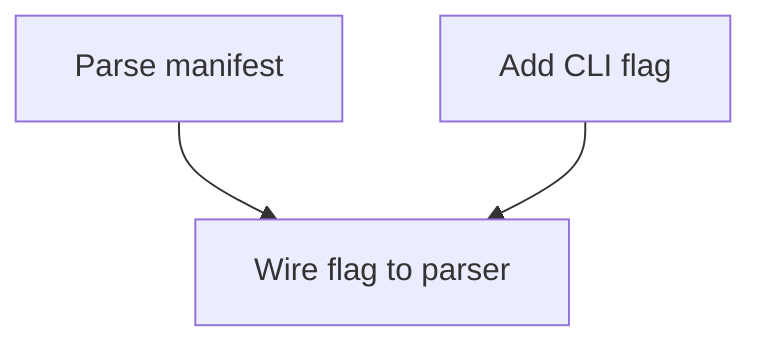

# ADR 015 — Work-item file schema and `_graph.md` format

**Status:** Accepted
**Date:** 2026-05-08

## Context

The project-manager phase decomposes architect-emitted initiatives into atomic work items the developer loop consumes ([`docs/phases/project-manager.md`](../phases/project-manager.md), [`skills/project-manager/SKILL.md`](../../skills/project-manager/SKILL.md)). The phase doc left three load-bearing decisions open:

1. Work-item-id scheme — per-initiative numbering vs global ULID.
2. `_graph.md` mermaid format.
3. Work-item frontmatter schema — required fields, types, validation rules.

Without these locked, the PM bench cannot deterministically score outputs, the orchestrator cannot validate before handing items to the developer loop, and every PM session would have to invent its own shape (the same drift problem [ADR 014](./014-roadmap-format.md) solved for `roadmap.md`).

Brain themes consulted: [`spec-driven-work-items`](../../brain/forge/themes/spec-driven-work-items.md) (Given-When-Then is the contract; declarative > imperative), [`design-is-the-bottleneck`](../../brain/forge/themes/design-is-the-bottleneck.md) (v1 evidence — bad decomposition produces churn), [`work-item-completion-by-domain`](../../brain/forge/themes/work-item-completion-by-domain.md) (109-item v1 dataset; domain complexity, not item count, predicts failure), [`markdown-artifact-flow`](../../brain/forge/themes/markdown-artifact-flow.md) (greppable markdown is the protocol), and [`brain/projects/env-optimiser/themes/specify-driven-features.md`](../../brain/projects/env-optimiser/themes/specify-driven-features.md) (env-optimiser already expects PM to use `WI-N` IDs in `tasks.md`).

[ADR 007](./007-markdown-artifact-flow.md) §"greppable" and [ADR 008](./008-jsonl-event-log.md) (events reference `work_item_id`) further constrain the choice: IDs must be locally meaningful and cheap to grep across `projects/<name>/`.

## Decision

### 1. Work-item ID — `WI-<n>` per-initiative numbering

Format: `WI-<n>` where `<n>` is a 1-indexed integer, contiguous within a single initiative. Numbering restarts at 1 for every new initiative.

**Rationale.** Per-initiative locality keeps grep hits scoped (`grep -r 'WI-3' projects/<name>/.forge/work-items/` returns one match per initiative directory). Global ULIDs add cross-initiative joinability we don't currently need — the JSONL event log (ADR 008) already provides `(initiative_id, work_item_id)` pairs for that. The format already appears in the SKILL.md prompt and phase-doc examples, and `brain/projects/env-optimiser/themes/specify-driven-features.md` mandates `WI-N` IDs flow through to `tasks.md`. Switching to ULID now would invalidate that brain theme.

### 2. `_graph.md` mermaid format

```markdown
# Work-item dependency graph


```

**Rules:**

- Single `graph TD` block. Top-down so the human reading the graph reads roots-first.
- One node per work item. Node label is the work item's `title` (from frontmatter or first-line spec heading), quoted with `"…"` to allow spaces and punctuation.
- Edges run **prerequisite → dependent**. `WI-1 --> WI-3` means WI-3's `depends_on` includes `WI-1`.
- Edges must agree exactly with the union of all `depends_on` lists across the WI files. The graph is a derived view; mismatch = bug.
- Written to `<worktree>/.forge/work-items/_graph.md`, once, at the end of decomposition.
- One graph per initiative. Multi-initiative worktrees overwrite the file with the latest initiative's graph (PM only emits a graph for the initiative it's currently decomposing).

### 3. Work-item frontmatter schema

```yaml
---
work_item_id: WI-3                              # /^WI-\d+$/, unique within initiative
feature_id: FEAT-2                              # /^FEAT-\d+$/, must exist in initiative manifest
initiative_id: INIT-2026-05-08-add-oauth        # matches manifest's initiative_id
status: pending                                 # pending | in-progress | complete | failed
depends_on:                                     # array of WI-ids; must form a DAG
  - WI-1
  - WI-2
acceptance_criteria:                            # >= 1 entry, each with non-empty given/when/then
  - given: a request with no auth header
    when:  the OAuth middleware processes it
    then:  it returns 401 without contacting the upstream
files_in_scope:                                 # >= 1 entry; worktree-relative paths
  - src/auth/middleware.ts
  - src/auth/middleware.test.ts
estimated_iterations: 3                         # int > 0; soft hint to the Ralph loop
---

<free-form markdown rationale + per-criterion notes; no code>
```

**Validation rules** (enforced by `orchestrator/work-item.ts:validateWorkItem`):

- `work_item_id`, `feature_id`, `initiative_id` match their respective regexes.
- `status` ∈ the four-value enum above. Default `pending` on emission.
- `depends_on` references resolve within the same initiative's WI set. Cycles rejected (DFS three-color check, same pattern as `manifest.ts:detectCycle`).
- `acceptance_criteria` has ≥ 1 entry; each entry has non-empty `given`, `when`, `then` strings.
- `files_in_scope` has ≥ 1 entry. Each entry is a worktree-relative path (no leading `/`, no `..`).
- `estimated_iterations` > 0.
- Body is free-form markdown. **No code blocks containing implementations** — acceptance criteria are the contract, the developer loop writes the code. (Enforced by convention, not validator.)

### 3a. Optional extension fields (added 2026-05-20 per [CONTRACTS.md C5](../planning/2026-05-20-refinement/CONTRACTS.md))

Four optional fields extend the schema. **All four are omit-on-undefined: a WI without any of them produces frontmatter byte-identical to the pre-amendment shape.** A round-trip preservation test in `orchestrator/work-item.test.ts` asserts byte-equality for the pre-amendment WI; a refactor that changes the serialisation order of the existing fields would break it.

```yaml
quality_gate_cmd: ["npm", "test", "--", "tests/x.test.ts"]   # per-WI gate command override
non_goals: ["docs", "the bar component"]                     # explicit out-of-scope items
verification_artifact: tests/x.test.ts                       # path the dev-loop must produce
creates: [tests/x.test.ts]                                   # files this WI creates from scratch
```

**Validation rules** (enforced by `orchestrator/work-item.ts:validateWorkItem`):

- `quality_gate_cmd`, if present, is a non-empty array of non-empty strings.
- `non_goals`, if present, is an array of non-empty strings.
- `verification_artifact`, if present, is a non-empty string AND must appear in `files_in_scope`.
- `creates`, if present, is an array of non-empty strings AND every entry must appear in `files_in_scope`.

**Serialisation rule (load-bearing):** when a field is `undefined` OR an empty array OR an empty string, it is **omitted** from the YAML frontmatter — not serialised as `[]` / `""` / `null`. This keeps every WI written before the 2026-05-20 amendment byte-identical on round-trip.

**`demo_hook` is NOT a WI field** (per C5 / C15b). It lives at the initiative level only; PM does not author demos.

### 4. File location

- Work-item files: `<worktree>/.forge/work-items/<work-item-id>.md`.
- Dependency graph: `<worktree>/.forge/work-items/_graph.md`.
- `.forge/` is gitignored at the project level (per [ADR 007](./007-markdown-artifact-flow.md) — work items are scratch artifacts the developer loop consumes; they don't ship in PRs and they don't survive cycle resets).

## Consequences

**Positive:**

- The PM bench can deterministically assert WI shape, dep-graph correctness, file-coupling absence, and parallel-fraction targets.
- The orchestrator validates WIs before dispatching to the developer loop — bad decompositions surface at PM-end, not three Ralph iterations into the wrong abstraction.
- The graph is a cheap human checkpoint: a reviewer can `cat _graph.md` and eyeball whether the decomposition matches their mental model of the feature.
- WI-`<n>` is short enough to fit in commit messages and PR titles (`feat(WI-3): wire flag to parser`).

**Negative / accepted trade-offs:**

- Per-initiative IDs collide across initiatives. Accepted — the directory structure (`<worktree>/.forge/work-items/` lives under a worktree which is itself per-initiative-cycle) plus the manifest's `initiative_id` disambiguate. Cross-initiative joins go through the event log, not WI IDs.
- The `_graph.md` is a derived artifact and can drift from `depends_on` if a human edits one without the other. Accepted — PM writes it last; the bench scores graph-vs-WI agreement; in production the developer loop only reads `depends_on`, so drift is detectable but not fatal.

## Alternatives considered

- **Global ULID for `work_item_id`.** Better for cross-initiative joins; worse for grep, mental-model loading, and human-readable PR titles. Rejected — joinability comes from the event log, and humans + agents both read these IDs.
- **DOT instead of mermaid for `_graph.md`.** DOT renders elsewhere (`dot -Tpng`), but mermaid renders inline in GitHub, Obsidian, and IDE markdown previews — the readers we actually use.
- **Frontmatter-only WI files (no body).** Rejected — the rationale + per-criterion notes provide the "why" the developer loop needs when the criteria are ambiguous. Frontmatter is the contract; body is the briefing.
- **JSON instead of YAML frontmatter + markdown body.** Rejected — breaks ADR 007's "documentation = data" property. JSON is harder to read in a PR diff and can't carry the markdown body without escaping.
- **Defer the schema until the first PM session writes one.** Rejected — same reasoning as ADR 014: the bench needs *some* canonical shape to score against, and re-litigating per-fixture is more expensive than locking v0 now.

## References

- [ADR 007](./007-markdown-artifact-flow.md) — markdown-as-spec discipline this ADR specialises.
- [ADR 008](./008-jsonl-event-log.md) — event log carries `work_item_id` for cross-initiative joins.
- [ADR 014](./014-roadmap-format.md) — `roadmap.md` schema; same lock-it-before-the-bench rationale.
- [`docs/phases/project-manager.md`](../phases/project-manager.md) — phase doc this ADR resolves.
- [`skills/project-manager/SKILL.md`](../../skills/project-manager/SKILL.md) — interactive skill that emits work items.
- [`orchestrator/manifest.ts`](../../orchestrator/manifest.ts) — manifest schema; sibling pattern for `work-item.ts`.
- Brain themes: `spec-driven-work-items`, `design-is-the-bottleneck`, `work-item-completion-by-domain`, `markdown-artifact-flow`, `brain/projects/env-optimiser/themes/specify-driven-features`.

## Refinement 2026-05-20 (S3, batch `2026-05-20-refinement`)

**Amendment** — does not replace any of §1-4. Adds §3a (optional extension fields). All four new fields (`quality_gate_cmd`, `non_goals`, `verification_artifact`, `creates`) are optional and omit-on-undefined; pre-amendment WIs round-trip byte-identically.

**Why now.** The 2026-05-18 intersection-backpressure cycle surfaced a class of decomposition failures the 6-criterion bench couldn't catch: feature hallucination (WI-8 declared `FEAT-5` against a 4-feature manifest), file-creation ambiguity (multiple WIs implicitly "created" the same file), and trivially-green dev-loops (no per-WI gate ⇒ Ralph exits on iteration 0 because the whole-project test pass). These four fields make each of those failure modes deterministically scoreable.

**Cross-references.**
- [CONTRACTS.md](../planning/2026-05-20-refinement/CONTRACTS.md) C5 (the locked contract), C5a (the `knownFeatureIds` load-bearing wiring), C5b (the hallucinated-FEAT recovery flow), C11 (`initiatives.json` migration).
- [Plan 03](../planning/2026-05-20-refinement/03-project-manager.md) §"Required WI fields", §"Bench redesign".
- Reference implementation: `orchestrator/work-item.ts` (parser, validator, omit-on-undefined serialiser); `orchestrator/work-item.test.ts` (round-trip test); `benchmarks/project-manager/scoring.ts` (the deterministic `files_real_or_explicitly_new` and `one_creator_per_file` criteria that consume `creates`).

The schema fields locked in §1-3 (`work_item_id`, `feature_id`, `initiative_id`, `status`, `depends_on`, `acceptance_criteria`, `files_in_scope`, `estimated_iterations`) remain required. The four new fields in §3a remain optional indefinitely — they tighten signal without breaking any WI that doesn't need them.
